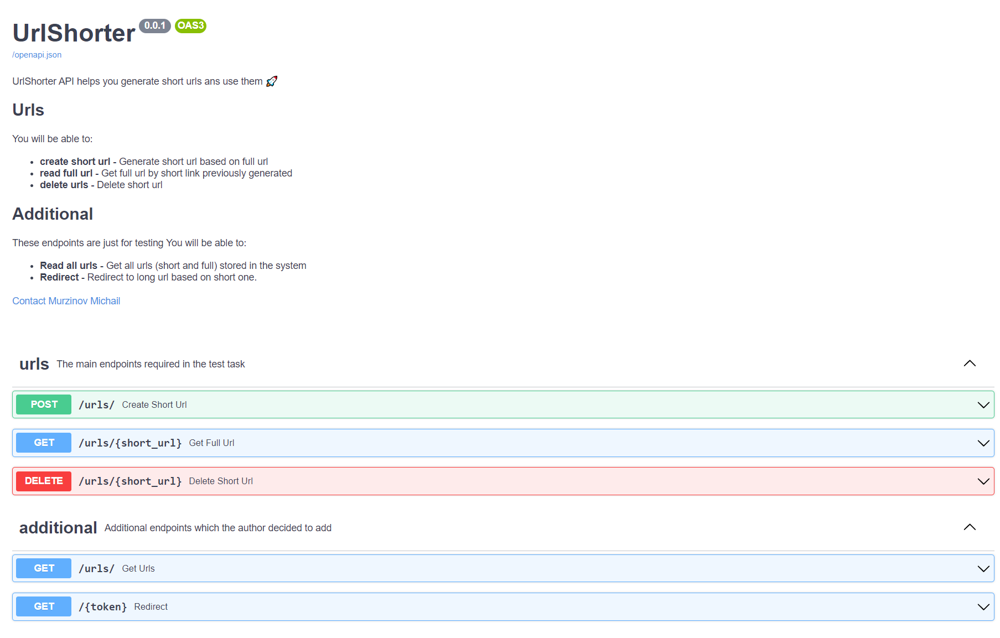

# UrlShorter
Сервис генерации короткой ссылки

Для локального запуска сервиса требуется:
Python >= 3.9
Poetry - https://python-poetry.org/  
PostgreSQL - https://www.postgresql.org/. Можно поднять локально, либо в докере (image postgres:latest).

1. Клонируем репозиторий
2. Устанавливаем зависимости - poetry install (https://python-poetry.org/docs/cli/#install)
3. В src/url_shorter/db/config.py меняем значение переменной **DATABASE_URL**
4. Из дериктории /src запускаем сервис - **uvicorn url_shorter:app.app**
5. Интерактивная документация - 127.0.0.1:8000/docs

